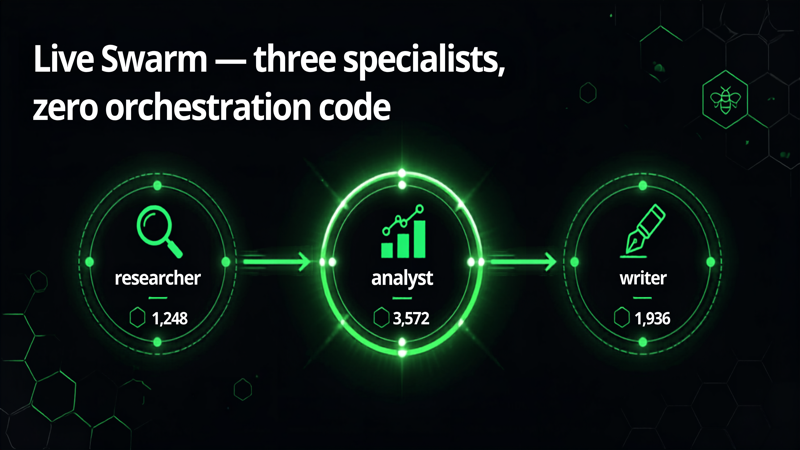

# 06 · Live Swarm



Researcher, analyst, and writer collaborating, with animated handoffs and per-agent token cost.

## What it shows

This multi-agent demo runs a team of three specialized agents that hand work to each other: a researcher gathers facts, an analyst distills insights and trade-offs, and a writer produces the final answer. The Insights panel animates each handoff and shows per-agent token cost. The teaching point: instead of one agent doing everything, a swarm splits the job by role and passes control along, and you can watch which node is active and what each one costs.

## How it works

The entrypoint (`agent.py`) builds a Strands `Swarm` from the `strands.multiagent` module on each turn (`_build_swarm`). Three `Agent` instances share one `BedrockModel` (default `us.amazon.nova-pro-v1:0`, overridable via `MODEL_ID`):

- `researcher`: gathers 3 to 5 key facts, then hands off to the analyst. Never answers the user directly.
- `analyst`: extracts the 2 to 3 most important insights and trade-offs, then hands off to the writer. Never answers directly.
- `writer`: turns the analyst's insights into a short, friendly answer in the user's language.

The `Swarm` is configured with `entry_point=researcher`, `max_handoffs=6`, and `max_iterations=10`.

The entrypoint consumes `swarm.stream_async(prompt)` and maps the multi-agent stream to demo events:

- `multiagent_node_start`: a node becomes active. Emitted as `node_start`.
- `multiagent_node_stream`: only the writer's text is streamed to the chat as `token` events; the other nodes work behind the scenes and their activity shows only in the graph.
- `multiagent_handoff`: emitted as one `handoff` event per source-to-destination pair.
- `multiagent_result`: emitted as `swarm_metrics`, which aggregates per-node token usage (`_node_metrics` reads each node's `accumulated_usage`), the ordered `node_history`, and the final `status`.

This demo defines no custom tools and no hooks; the collaboration comes entirely from the swarm structure and per-agent prompts.

## Files

- `agent.py`: builds the three-agent `Swarm`, streams the multi-agent events, and aggregates per-node metrics.
- `requirements.txt`: `bedrock-agentcore`, `strands-agents[otel]`, `strands-agents-tools`, `aws-opentelemetry-distro`.

## Events emitted

- `node_start`: `{type, node}`, which agent just became active.
- `token`: chat text (writer node only).
- `handoff`: `{type, from_agent, to_agent}`, drives the animated handoff arrows.
- `swarm_metrics`: `{type, nodes, node_history, status}`, per-node token usage plus the run summary.
- `error` / `done`.

## Run it

Deployed as its own AgentCore Runtime (stack `StrandsDemo06Stack`). From the repo root:

```bash
python scripts/smoke_test.py swarm "Should a small team pick serverless or containers for a new API?"
```

Watch control move researcher to analyst to writer, with a handoff animation at each step and a token cost per agent when the run finishes.
