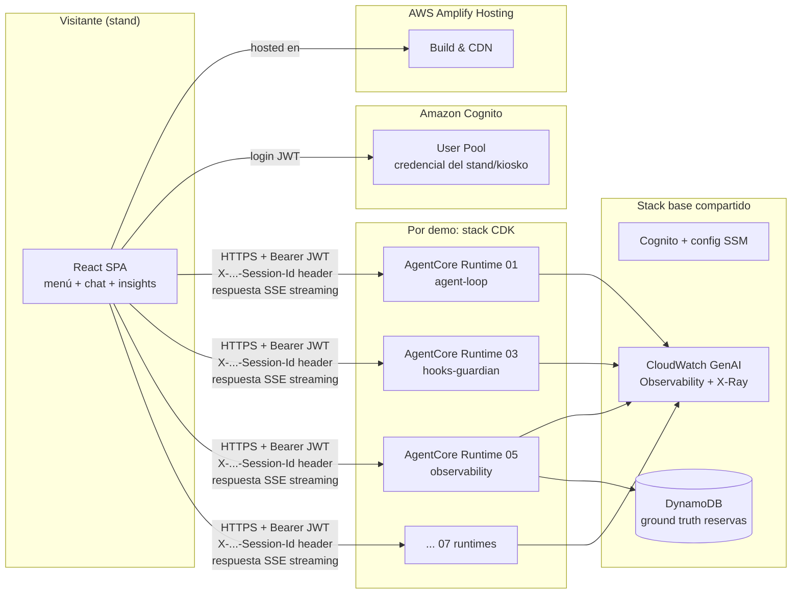

# Plan — Strands Agents Interactive Demo Showcase

Página web (Amplify) para stands de eventos que muestra, de forma visual e interactiva,
las capacidades del framework Strands Agents. Cada demo corre en su propio
Amazon Bedrock AgentCore Runtime desplegado con CDK.

> Estado: PLAN — nada implementado todavía. Los puntos marcados ⚠️ requieren
> verificación contra la documentación oficial antes de codificar.

---

## 1. Concepto

**Audiencia:** visitantes de un stand en eventos. Tienen 2–5 minutos, quieren ver algo
llamativo, no leer documentación.

**Experiencia por demo (layout de dos paneles):**

```
┌────────────┬──────────────────────────┬──────────────────────────────┐
│            │  CHAT                    │  🔍 INSIGHTS (el "wow")      │
│  MENÚ      │                          │                              │
│  (demos    │  usuario ↔ agente        │  Panel específico por demo:  │
│  agrupadas │  streaming token a token │  · spans/tokens en vivo      │
│  por       │                          │  · hooks bloqueando tools    │
│  categoría)│                          │  · grafo multi-agente        │
│            │                          │  · medidor de tokens         │
│            │  [input + sugerencias]   │  [🔍 ¿Por qué importa?]      │
└────────────┴──────────────────────────┴──────────────────────────────┘
```

- **Chat:** conversación con el agente de la demo, streaming en tiempo real.
- **Insights:** visualización en vivo de lo que pasa "debajo": tool calls, spans,
  tokens, bloqueos de hooks, handoffs entre agentes. Es la pantalla que se ve
  desde lejos en el stand.
- **La lupa (🔍):** botón en cada demo que abre un overlay "¿Por qué esto es
  interesante?" — 3 bullets + el snippet de código Strands real (5–15 líneas)
  que hace posible la demo. Mensaje: "esto que ves son ~10 líneas de código".
- **Sugerencias de prompt:** cada demo trae 3–4 prompts de un clic para que el
  visitante no tenga que pensar qué escribir.

**Clave técnica que hace todo esto posible:** el agente no streamea solo texto.
El entrypoint emite **eventos JSON tipados** (`token`, `tool_call_start`,
`tool_result`, `hook_blocked`, `handoff`, `metrics`, `interrupt`, …). El chat
renderiza los `token`; el panel Insights renderiza todo lo demás. Un solo
protocolo de eventos para las 7 demos.

---

## 2. Catálogo de demos (agrupadas por categoría)

Criterio de selección: cada demo debe (a) ser visual en <30 segundos, (b) mostrar
una capacidad diferenciadora de Strands, (c) reutilizar código ya probado de los
repos de referencia cuando exista.

### Categoría A — Fundamentos del agente

**01 · Agent Loop en vivo** (`tools` built-in + custom, streaming)
- Agente asistente con tools built-in (`calculator`, `current_time`, `http_request`)
  y una custom tool con `@tool`.
- **Insights:** diagrama animado del agent loop (Reasoning → Tool selection →
  Execution → Response) que se ilumina en tiempo real con cada ciclo, usando los
  eventos de `stream_async`. Contador de ciclos y tokens por ciclo.
- **Lupa:** "un agente con tools en 5 líneas de Python".

**02 · Structured Output** (`structured_output_model` + Pydantic)
- El visitante pega texto libre (una reseña, un email, la descripción de su
  empresa) y el agente lo convierte en datos tipados.
- **Insights:** el schema Pydantic dibujado como formulario que se va llenando
  campo a campo, con validación en verde. Si falla la validación, se ve el retry.
- **Lupa:** "del texto libre al JSON validado sin parsear nada a mano".

### Categoría B — Seguridad y control

**03 · Hooks: el guardián** (`BeforeToolCallEvent`, cancelación de tools)
- Agente de "operaciones" con tools peligrosas simuladas (`delete_database`,
  `send_email_blast`, `refund_payment`) protegidas por hooks: bloqueo por nombre,
  por límite de llamadas (`LimitToolCounts`) y por argumentos (montos > $100).
  El visitante intenta convencer al agente de hacer algo prohibido.
- **Insights:** "muro de seguridad" — cada intento aparece como tarjeta:
  🟢 permitido / 🔴 BLOQUEADO con el motivo y el hook que lo detuvo. Contador
  grande de bloqueos. Muy efectivo en stand: la gente juega a romperlo.
- **Lupa:** el código del `HookProvider` que cancela la tool (~12 líneas).
- Base: cookbook de hooks de Strands + `hooks.py` de stop-wasting-tokens
  (`DebounceHook`, `LimitToolCounts` ya escritos y probados).

**04 · Human-in-the-loop** (interrupts)
- Agente de reservas de viaje que busca vuelos solo, pero **se detiene y pide
  aprobación humana** antes de ejecutar `book_flight` (interrupt desde hook en
  `BeforeToolCallEvent`).
- **Chat:** aparecen botones Aprobar ✅ / Rechazar ❌ — el visitante decide.
- **Insights:** timeline del flujo con el momento exacto de la pausa: "el agente
  está congelado esperando a un humano". Estado del interrupt persistido en sesión.
- Base: tools de viaje del repo de observability (`search_flights`, `book_flight`).

### Categoría C — Observabilidad

**05 · Rayos X del agente** (metrics + traces OTEL + atributos custom)
- El mismo agente de viajes, instrumentado a fondo: `result.metrics.get_summary()`
  + `StrandsTelemetry` + hook `AfterToolCallEvent` que etiqueta reservas VIP
  (`business.vip_booking`).
- **Insights (la pantalla más rica):**
  - Árbol de spans en vivo (`invoke_agent → cycle → chat → execute_tool …`).
  - Barras de latencia por tool y tokens input/output por ciclo.
  - Tarjetas de atributos de negocio cuando saltan (💎 VIP booking $88).
  - "Ground truth": lo que el agente dijo vs. lo que quedó en la base de datos.
- **Lupa:** "instrumentación completa con 2 líneas: `StrandsTelemetry()`".
- Base: demos 01–03 del repo observability-for-agents (reutilización directa de
  `travel_tools.py` y el hook `TagVipBookings`).

### Categoría D — Multi-agente

**06 · Swarm en vivo** (handoffs entre agentes especializados)
- Swarm de 3 agentes (p. ej. investigador → analista → redactor) resolviendo la
  pregunta del visitante, con `entry_point`, `max_handoffs`, estado compartido
  vía `invocation_state`.
- **Insights:** grafo de nodos donde el agente activo pulsa/brilla, las aristas
  se animan en cada handoff, y cada nodo muestra sus tokens acumulados
  (`result.results[node].result.metrics.accumulated_usage`). Al final: resumen
  de la colaboración (quién hizo qué, node_history).
- **Lupa:** "tres agentes coordinándose: `Swarm([a, b, c])`".
- Base: `swarm_demo.py` de stop-wasting-tokens.

### Categoría E — Optimización de contexto

**07 · Stop Wasting Tokens** (memory pointer vs. naive, side-by-side)
- La misma pregunta sobre un dataset grande de logs se ejecuta contra dos agentes:
  naive (logs crudos al contexto) vs. memory-pointer (`agent.state` + puntero de
  ~50 tokens) + `SlidingWindowConversationManager`.
- **Insights:** dos medidores de tokens tipo tanque llenándose en paralelo
  (57.500 vs ~500 en la demo original), tiempo de respuesta, y estimación de
  costo mensual a escala ("×1000 usuarios/día = $X vs $Y"). El contraste es el show.
- **Lupa:** el patrón `@tool(context=True)` + `ToolContext` (~10 líneas).
- Base: demo 01 de stop-wasting-tokens (tools y comparativa ya escritas).

### Fase 2 (backlog, no en el primer despliegue)
- **Memoria persistente** (AgentCore Memory: "el agente recuerda tu nombre si
  vuelves al stand") — patrón completo ya resuelto en el repo de WhatsApp.
- **MCP tools** (agente consumiendo un servidor MCP, con el patrón async handleId).
- **Guardrails de Bedrock** (filtrado de contenido/PII a nivel de plataforma).
- **Voz** (bidirectional streaming / Nova Sonic) — altísimo impacto en stand pero
  complejidad de audio en navegador; evaluar tras la v1.

---

## 3. Arquitectura



### 3.1 Invocación segura de cada runtime (requisito: seguridad + sesión)

**Recomendación: inbound auth JWT nativa de AgentCore (sin capa proxy).**

- Cada `CfnRuntime` se configura con `authorizer_configuration` →
  `CustomJWTAuthorizerProperty` apuntando al **discovery URL del Cognito User Pool**
  y `allowed_clients` = el app client del frontend. ⚠️ Verificar nombres exactos
  de las propiedades L1 en `aws_bedrockagentcore.CfnRuntime` antes de codificar.
- El frontend hace login contra Cognito (Amplify Auth / amazon-cognito-identity-js),
  obtiene el JWT, e invoca el endpoint HTTPS del runtime directamente:
  - `Authorization: Bearer <access_token>`
  - `X-Amzn-Bedrock-AgentCore-Runtime-Session-Id: <sessionId>` (**≥33 chars**,
    patrón del repo WhatsApp: `demo01-<uuid>` con `ljust(33,'0')`)
  - Respuesta streaming SSE (el entrypoint es un generador async).
- **Sesión en cada invocación:** el `sessionId` se genera al abrir la demo y vive
  en el estado del SPA; el mismo ID en cada turno mantiene el microVM y el
  historial de conversación. Botón "Reiniciar demo" = nuevo sessionId (importante
  en un stand: cada visitante estrena sesión limpia).
- AgentCore aísla cada sesión en su propio microVM — esto además ES un punto de
  venta que la UI puede mostrar ("tu sesión: microVM dedicado").

**Por qué no un proxy Lambda/API Gateway:** añade un salto, complica el streaming
SSE (Lambda response streaming en Python no es trivial) y AgentCore ya resuelve
authn/authz + throttling. Plan B documentado: si el JWT authorizer diera problemas,
proxy ligero con API Gateway HTTP API + Lambda y SigV4 hacia el runtime.

### 3.2 Estructura del repo (monorepo)

```
strands-agents-demo-sample-for-aws/
├── README.md                  # tabla de cards por demo (estilo global de Eli)
├── LICENSE / CONTRIBUTING.md / CODE_OF_CONDUCT.md   # MIT-0, plantillas aws-samples
├── PLAN.md                    # este documento
├── infra/                     # CDK (Python), una app
│   ├── app.py
│   ├── stacks/
│   │   ├── base_stack.py      # Cognito UP + app client, DynamoDB, SSM params
│   │   └── demo_stack.py      # stack parametrizado: 1 instancia por demo
│   └── constructs/
│       ├── agentcore_runtime.py   # CfnRuntime code-based (ZIP S3) + endpoint
│       └── agentcore_role.py      # rol mínimo por runtime
├── agents/                    # un directorio por demo, autocontenido
│   ├── common/                # protocolo de eventos SSE, emisor, base entrypoint
│   ├── 01-agent-loop/         #   agent.py + tools.py + requirements.txt
│   ├── 02-structured-output/
│   ├── 03-hooks-guardian/
│   ├── 04-human-in-the-loop/
│   ├── 05-observability/
│   ├── 06-swarm/
│   └── 07-token-optimization/
├── web/                       # React + Vite + TypeScript (SPA para Amplify)
│   ├── src/
│   │   ├── lib/agentcore.ts   # cliente: JWT, sessionId, parser SSE, retry
│   │   ├── components/        # ChatPane, InsightsPane, LupaOverlay, DemoMenu
│   │   ├── insights/          # un renderer de insights por demo
│   │   └── demos.config.ts    # catálogo: ARN (via env), prompts sugeridos, copy de la lupa
│   └── amplify.yml
└── scripts/
    ├── create_deployment_package.sh   # ZIP ARM64 con uv (patrón repo WhatsApp)
    └── smoke_test.py                  # invoca cada runtime post-deploy
```

### 3.3 Patrones CDK (heredados del repo WhatsApp, ya probados)

- **Runtime code-based (ZIP en S3), no Docker:** `CfnRuntime` con
  `CodeConfigurationProperty` (S3 + `entry_point=["agent.py"]`,
  `runtime="PYTHON_3_11"`), ZIP construido con
  `uv pip install --python-platform aarch64-manylinux2014 --only-binary=:all:`.
  Deploy más rápido y sin ECR — ideal para 7 runtimes.
- **`CfnRuntimeEndpoint`** por runtime; ARNs exportados a **SSM Parameter Store**
  (`/strands-demos/<demo>/runtime_arn`) — mismo patrón cross-stack del repo WhatsApp.
  El build de Amplify lee los SSM params y los inyecta como `VITE_*`.
- **Lifecycle:** `idle_runtime_session_timeout=900`, `max_lifetime=28800`.
- **Rol IAM por runtime, mínimo:** `bedrock:InvokeModel*`, logs, X-Ray
  (`AWSXRayDaemonWriteAccess`), y solo la demo 05 lee/escribe su DynamoDB.
- **`RemovalPolicy.DESTROY` en TODO** (+ `auto_delete_objects=True` en buckets):
  es un sample; `cdk destroy` debe dejar la cuenta limpia.
- Un `DemoStack` parametrizado (nombre, dir del agente, env vars, permisos extra)
  instanciado 7 veces — no 7 stacks copy-paste.

### 3.4 Resiliencia y observabilidad de la plataforma

- **Cliente web con retry + backoff exponencial** para los errores conocidos de
  AgentCore: 424 `RuntimeClientError` (microVM frío), 429, 500 — 3 intentos,
  delay 2·2ⁿ (números validados en el repo WhatsApp).
- **Timeout y estado visible:** si el runtime no responde en N s, la UI muestra
  "despertando al agente…" (cold start) en vez de colgarse — crítico en stand.
- **Degradación elegante:** si una demo cae, el menú la marca offline y las otras
  6 siguen funcionando (runtimes independientes = aislamiento de fallos real).
- **Observabilidad:** ADOT + `strands-agents[otel]` en cada runtime → CloudWatch
  GenAI Observability (habilitar **Transaction Search** una vez por cuenta).
  La demo 05 lo muestra al público; el resto lo usamos nosotros para depurar.
- **Persistencia / ground truth:** reservas y acciones en DynamoDB — si algo
  falla en vivo, los datos son consultables por fuera (lección del CLAUDE.md).
- **Smoke test post-deploy:** `scripts/smoke_test.py` invoca los 7 runtimes con
  un prompt canario antes de dar por bueno un deploy.

### 3.5 Puntos de fallo identificados

| Riesgo | Mitigación |
|---|---|
| Cold start de microVM (424) en pleno demo | Retry automático + mensaje "despertando…"; opcional: ping de calentamiento al abrir cada demo |
| Throttling de Bedrock con mucho público | Modelo con buen quota (inference profile cross-region); mensajes de espera honestos |
| WiFi del evento inestable | SSE se reconecta por turno (stateless entre turnos gracias al sessionId); la UI reintenta |
| JWT expira a mitad de demo | Refresh token silencioso vía Amplify Auth |
| Cambio de código sin refresh del runtime | Documentado: tras deploy, sesiones nuevas (o esperar idle timeout de 15 min) |
| Visitante escribe contenido problemático | System prompts defensivos + demo 03 lo convierte en feature; Fase 2: Guardrails |

---

## 4. Web (Amplify) — lineamientos para la fase de diseño

El diseño detallado se hará después (acordado), pero queda fijado lo verificado:

- **Colores de marca Strands** (extraídos del CSS real de strandsagents.com):
  - Fondo dark: `#17181c` / `#0e0e0e`
  - Acento verde (dark theme): `#00cc5f`, high `#00ff77`
  - Azul índigo (light theme): `#3d50f5` / `#3369ff`
  - Dirección: **tema oscuro con acento verde** — es el look del sitio oficial y
    luce en pantallas de stand.
- Stack: React + Vite + TypeScript, deploy con **Amplify Hosting** conectado al
  repo (branch `main`, `amplify.yml` en `web/`).
- Modo kiosko: fuentes grandes, animaciones en el panel Insights visibles a 2 m,
  botón "Reiniciar" prominente, sugerencias de prompt de un clic.

---

## 5. Fases de implementación

1. **Fase 0 — Esqueleto verificado (1 demo end-to-end):** stack base + demo 01
   desplegada + SPA mínima con chat streaming y auth JWT. Aquí se validan los
   ⚠️: propiedades del JWT authorizer en `CfnRuntime`, streaming SSE del
   entrypoint, invocación directa desde navegador. **No se avanza sin esto probado.**
2. **Fase 1 — Protocolo de eventos + panel Insights:** emisor de eventos en
   `agents/common/`, renderer de insights genérico + el del agent loop.
3. **Fase 2 — Las 6 demos restantes** (en orden de impacto de stand: 03 hooks,
   07 tokens, 06 swarm, 05 observability, 04 HITL, 02 structured output),
   cada una con su insight renderer y su copy de lupa.
4. **Fase 3 — Pulido de stand:** diseño visual final (colores Strands), modo
   kiosko, lupa con snippets, smoke tests, `pip-audit`, README con tabla de cards,
   archivos de gobernanza MIT-0.

Cada fase termina con prueba end-to-end real antes de pasar a la siguiente
(regla: nada se da por funcionando sin ejecutarlo).

---

## 6. Decisiones tomadas y alternativas descartadas

| Decisión | Alternativa descartada | Por qué |
|---|---|---|
| JWT inbound auth de AgentCore | Proxy API Gateway + Lambda SigV4 | Menos piezas, streaming directo, authn nativa; el proxy queda como plan B |
| ZIP code-based en S3 | Contenedor Docker + ECR | 7 runtimes: build y deploy mucho más rápidos; patrón ya probado en el repo WhatsApp |
| 1 runtime por demo | 1 runtime multiplexado con un router | Aislamiento de fallos, IAM mínimo por demo, y cada demo es un ejemplo copiable independiente |
| Eventos JSON tipados sobre SSE | Parsear el texto del stream | El panel Insights necesita datos estructurados fiables, no regex sobre prosa |
| React SPA en Amplify Hosting | Next.js SSR | No hay contenido dinámico de servidor; SPA estática es más simple y barata |
