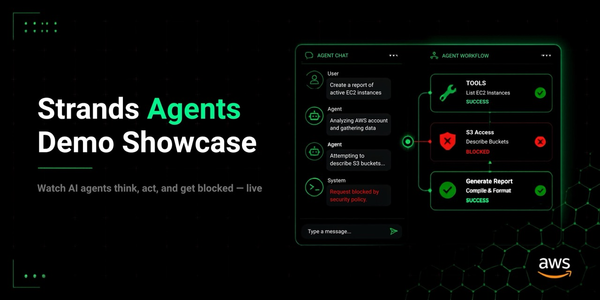
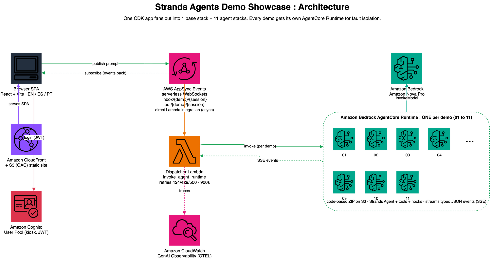

# Strands Agents Demo Showcase



An interactive, event-booth-ready web app that shows off the [Strands Agents](https://strandsagents.com/) framework: a chat on the left, and a live **"under the hood" panel** on the right that visualizes what the agent is actually doing in real time (cycles, tool calls, blocked actions, handoffs, and token usage).

Every demo runs on its own [Amazon Bedrock AgentCore Runtime](https://docs.aws.amazon.com/bedrock-agentcore/latest/devguide/what-is-bedrock-agentcore.html), deployed with AWS CDK. The browser talks to the agents through [AWS AppSync Events](https://docs.aws.amazon.com/appsync/latest/eventapi/event-api-welcome.html) (serverless WebSockets) secured with Amazon Cognito. The UI ships in **English, Spanish, and Portuguese**.

> 💡 This sample uses Strands Agents. The same patterns are general agent concepts and carry over to other agent frameworks.
>
> ⚠️ This guide assumes familiarity with AWS CDK, Python, and TypeScript/React basics. New to the stack? Jump to [Quick Start](#quick-start); one script deploys everything.

## Demos

| Demo | Category | What you see | Strands feature |
|------|----------|--------------|-----------------|
| [01 · Live Agent Loop](./agents/01-agent-loop/) | Fundamentals | The Reason → Tool → Respond loop animating in real time, with per-tool latency and token metrics | Tools, streaming, `result.metrics` |
| [02 · Structured Output](./agents/02-structured-output/) | Fundamentals | Free text becomes a validated, typed record, field by field | `structured_output_model` + Pydantic |
| [03 · Hooks: the Guardian](./agents/03-hooks-guardian/) | Safety & Control | Visitors try to talk the agent into dangerous actions; hooks block them with visible 🔴 cards | `BeforeToolCallEvent`, `cancel_tool` |
| [04 · Human-in-the-loop](./agents/04-human-in-the-loop/) | Safety & Control | The agent searches flights alone but **freezes** before booking; you approve or reject | `tool_context.interrupt()` |
| [05 · Agent X-Ray](./agents/05-observability/) | Observability | A travel agent instrumented to the bone: business attributes, per-tool latency, ground-truth ledger | OTEL traces, `trace_attributes`, hooks |
| [06 · Live Swarm](./agents/06-swarm/) | Multi-agent | Researcher → analyst → writer collaborating, with animated handoffs and per-agent token cost | `Swarm`, multi-agent streaming |
| [07 · Stop Wasting Tokens](./agents/07-token-optimization/) | Context engineering | The same question, two agents: ~27k tokens vs ~1.4k (−95%) on live meters | `agent.state`, `@tool(context=True)` |
| [08 · Graph Pipeline](./agents/08-graph/) | Multi-agent | A deterministic DAG: brainstormer → (fact-checker + critic) → editor | `GraphBuilder`, parallel nodes |
| [09 · Agents as Tools](./agents/09-agents-as-tools/) | Multi-agent | A concierge delegates to specialist agents called like functions | `agent.as_tool()` |
| [10 · Memory Poisoning](./agents/10-memory-poisoning/) | Safety & Control | Plant a malicious note in turn 1, trigger it in turn 2; the tool boundary blocks exfiltration | `agent.state`, pure-function gate |
| [11 · Chaos Testing](./agents/11-chaos-resilience/) | Safety & Control | Press play: the same question runs twice under injected chaos. Without the harness the agent reports garbage (999 °C); with it, a hook catches the impossible value and retries | `AfterToolCallEvent`, `event.retry` |
| 🤖 Robots | (placeholder) | Space reserved for a live-robot video: the same agent loop driving physical hardware | N/A |

## Input guardrails

Every demo applies a lightweight, deterministic input filter before the prompt reaches the model. The filter runs in the AgentCore runtime entrypoint — no extra model call, no added latency — and covers:

| Rule | Demos |
|------|-------|
| **Off-topic / out-of-scope** — rejects requests to write code, essays, translations, "act as X", etc. | All except 03 and 10 |
| **Jailbreak / instruction-override** — blocks "ignore your instructions", "you are DAN", role-override attempts | All except 03 and 10 |
| **System-prompt extraction** — blocks "repeat your instructions", "show me your rules", etc. | All except 03 and 10 |
| **Input length cap** (2,000 chars) and **per-session rate limit** (20 req/min) | All 11 demos |

Demos **03 · Hooks: the Guardian** and **10 · Memory Poisoning** are attack demos: their scope/jailbreak/extraction rules are intentionally off so visitors can send adversarial prompts and watch the *actual* defense mechanisms (hooks and tool-boundary gates) do the blocking.

When a prompt is blocked, a refusal message streams to the **chat** (trilingual EN/ES/PT) and a `guardrail_blocked` card appears in the Insights panel. The model is never called. Implementation: [`agents/common/guardrails.py`](./agents/common/guardrails.py).

## Architecture



The browser publishes a prompt to AppSync Events on `inbox/<demo>/<session>`. AppSync invokes the dispatcher Lambda, which calls `invoke_agent_runtime` on the demo's AgentCore Runtime. The runtime streams typed JSON events (SSE) back through the dispatcher to `out/<demo>/<session>`, where the browser is subscribed. The chat renders `token` events; the insights panel renders everything else.

### How the agents deploy: one CDK app, many stacks

There is a single CDK app (`infra/app.py`), yet the account ends up with one CloudFormation stack per demo. The app iterates over a `DEMOS` list (11 entries) and instantiates a `DemoStack` for each one, on top of a shared `BaseStack`. See [`infra/app.py:22-47`](./infra/app.py):

```python
base = BaseStack(app, "StrandsDemosBaseStack", env=env)

DEMOS = [
    {"demo_id": "01", "slug": "agent-loop", "agent_dir": "01-agent-loop"},
    # ... 11 entries total
    {"demo_id": "11", "slug": "chaos-resilience", "agent_dir": "11-chaos-resilience"},
]

for demo in DEMOS:
    stack = DemoStack(app, f"StrandsDemo{demo['demo_id']}Stack", ...)
    stack.add_dependency(base)   # every demo stack waits for the shared base
```

So `cdk deploy --all` synthesizes and deploys **12 stacks**: `StrandsDemosBaseStack` (Cognito, AppSync Events, dispatcher Lambda) plus `StrandsDemo01Stack` through `StrandsDemo11Stack`, one AgentCore Runtime each. Adding a demo is a one-line change to `DEMOS`, no new CDK file needed. Because each demo is its own stack you can also deploy or destroy them one at a time (`cdk deploy StrandsDemo07Stack`).

Key design decisions:

- **One runtime per demo.** This gives fault isolation: if one demo breaks, the others keep working.
- **Typed event protocol** (`token`, `tool_call_start`, `hook_blocked`, `handoff`, `metrics`, …) with sequence numbers. AppSync fan-out does not guarantee ordering, so the client reorders.
- **Code-based (ZIP on S3) runtimes.** No Docker builds; a full demo deploys in about 75 seconds.
- **Multi-turn memory.** The same AgentCore `sessionId` is reused for the whole conversation, so Strands agents remember earlier turns. Starting a new session (the ↺ Restart button) issues a fresh `sessionId` and clears memory.
- **Everything is `RemovalPolicy.DESTROY`.** A `cdk destroy` leaves nothing behind, so there is **no standing cost** once you tear the stacks down.

## Quick Start

### Prerequisites

Before you deploy, make sure you have all of the following. `deploy.sh` uses every one of these.

**Tooling on your machine**

| Requirement | Why it is needed | Check |
|-------------|------------------|-------|
| Python 3.11+ | CDK app and agent runtimes target Python 3.11 (`uv venv --python 3.11`) | `python3 --version` |
| [uv](https://docs.astral.sh/uv/) | creates the virtualenv and installs Python dependencies | `uv --version` |
| Node.js 20+ | runs the CDK CLI (via `npx cdk`) and the Vite web app | `node --version` |
| [AWS CLI v2](https://docs.aws.amazon.com/cli/latest/userguide/getting-started-install.html) | reads stack outputs from SSM and creates the Cognito kiosk user | `aws --version` |
| AWS CDK v2 | synthesizes and deploys the stacks (invoked through `npx cdk`, no global install required) | `npx cdk --version` |
| OpenSSL | generates a random kiosk password when `KIOSK_PASSWORD` is not set | `openssl version` |

**AWS account setup**

- **Credentials configured** for the target account, for example via `aws configure`, `AWS_PROFILE`, or SSO. Confirm with `aws sts get-caller-identity`.
- **Amazon Bedrock model access** to Amazon Nova Pro (`us.amazon.nova-pro-v1:0`) in your Region. Request access in the Bedrock console under Model access. To use a different model, set `MODEL_ID` to any model your account can invoke.
- **Region.** The stacks default to `us-east-1`. Override with `AWS_REGION` (used by `deploy.sh`).
- **CDK bootstrap.** The environment must be bootstrapped for CDK v2. `deploy.sh` checks for the `CDKToolkit` stack and runs `cdk bootstrap` automatically if it is missing.
- **IAM permissions** to create the resources these stacks use: Amazon Bedrock AgentCore, AWS AppSync, AWS Lambda, Amazon Cognito, Amazon S3, Amazon CloudFront, AWS IAM, AWS CloudFormation, and AWS Systems Manager Parameter Store.

### One command (recommended)

```bash
KIOSK_PASSWORD='<choose-a-strong-password>' ./deploy.sh
```

`deploy.sh` runs the whole pipeline end to end: venv + CDK deps → bootstrap check → deploy all stacks (base + one per demo) → create the kiosk Cognito user → write `web/.env.local` from the stack outputs → deploy the web hosting stack (S3 + CloudFront) → run a smoke test. If it prints `SMOKE TEST OK`, the whole pipeline (Cognito → AppSync → Lambda → AgentCore → back) works.

### Manual steps

All commands below start from the repository root. Each step opens with a `cd` back to the root so you never lose track of where you are.

```bash
# 0. From the repository root, create and activate a virtualenv
python3 -m venv .venv && source .venv/bin/activate

# 1. Infra (all stacks: Cognito + AppSync Events + one stack per demo)
uv pip install -r infra/requirements.txt
(cd infra && cdk deploy --all --require-approval never)

# 2. Create the kiosk user (use the User Pool id from the stack outputs)
aws cognito-idp admin-create-user --user-pool-id <pool-id> --username kiosk --message-action SUPPRESS
aws cognito-idp admin-set-user-password --user-pool-id <pool-id> --username kiosk --password '<password>' --permanent

# 3. Web app: fill web/.env.local with the stack outputs, then run it locally
(cd web && npm install && npm run dev)

# 4. Smoke test the full pipeline (run from the repository root)
python scripts/smoke_test.py agent-loop "What is 23*47?"
```

Wrapping the `cd` in parentheses runs it in a subshell, so the directory change is scoped to that one command and you return to the repository root automatically.

## Estimated cost

This is a **community sample designed to be cheap to run and free to tear down**. There are no always-on servers: AgentCore Runtime, Lambda, and AppSync Events are all consumption-priced, and `cdk destroy` removes every resource.

All rates below are **US East (N. Virginia), on-demand, as published on the AWS pricing pages**. Prices change, so verify before you rely on them; the last column links each service's live pricing page so you can go deeper.

| 💵 Service | What you pay for | Rate (us-east-1) | 🔗 Pricing page |
|-----------|------------------|------------------|-----------------|
| 🧠 **AgentCore Runtime** (CPU) | active CPU, per second; I/O wait is free | `$0.0895` / vCPU-hour | [AgentCore pricing](https://aws.amazon.com/bedrock/agentcore/pricing/) |
| 🧠 **AgentCore Runtime** (memory) | peak memory, billed until the session ends | `$0.00945` / GB-hour | [AgentCore pricing](https://aws.amazon.com/bedrock/agentcore/pricing/) |
| 🤖 **Amazon Nova Pro** (input) | prompt tokens sent to the model | `$0.00092` / 1K tokens | [Bedrock pricing](https://aws.amazon.com/bedrock/pricing/) |
| 🤖 **Amazon Nova Pro** (output) | tokens the model generates | `$0.00368` / 1K tokens | [Bedrock pricing](https://aws.amazon.com/bedrock/pricing/) |
| 🔌 **AWS AppSync Events** | pub/sub operations + connection time | `$1.00` / M ops · `$0.08` / M conn-min | [AppSync pricing](https://aws.amazon.com/appsync/pricing/) |
| 🔑 **Amazon Cognito** | monthly active users | one kiosk user is well within the free tier | [Cognito pricing](https://aws.amazon.com/cognito/pricing/) |
| 🌐 **S3 + CloudFront** (static site) | storage + egress | pennies/month at booth traffic; first 1 TB CloudFront egress free | [S3](https://aws.amazon.com/s3/pricing/) · [CloudFront](https://aws.amazon.com/cloudfront/pricing/) |
| 📊 **CloudWatch** (logs + traces) | ingested log volume + stored traces | first 5 GB logs/month free; verbose logging is the sneakiest cost | [CloudWatch pricing](https://aws.amazon.com/cloudwatch/pricing/) |

**Worked example, a modest booth/community month of ~1,000 interactions** (assumptions stated so you can re-run the math): ~2,500 input + ~400 output tokens and ~5 seconds of active runtime per interaction.

- Nova Pro tokens: `1,000 × 2,500/1,000 × $0.00092` (input) + `1,000 × 400/1,000 × $0.00368` (output) ≈ **$2.30 + $1.47 = $3.77**
- AgentCore Runtime CPU: `1 vCPU × 5s × 1,000 = 5,000 vCPU-s = 1.39 vCPU-h × $0.0895` ≈ **$0.12**
- AgentCore Runtime memory: `0.5 GB × 5s × 1,000 = 2,500 GB-s = 0.69 GB-h × $0.00945` ≈ **$0.01** (see caveat below)
- AppSync Events: ~1 inbound + ~30 outbound events + connect/subscribe per interaction → tens of thousands of operations at $1/million ≈ **< $0.10**

**Ballpark: well under ~$5/month of usage cost** for that traffic, dominated by model tokens.

Two variables to watch:

- **Idle runtime memory.** AgentCore bills peak memory *until the session ends*. This stack sets `idleRuntimeSessionTimeout=900` (15 min), so memory can be billed for up to 15 minutes after the last message in a session. Lower it for less idle cost (at the price of more cold starts).
- **CloudWatch Logs.** Verbose logging is the sneakiest line item: AWS's own reference example reached several dollars a month on ~1.5 GB of verbose logs. Keep log volume modest in production.

> These are estimates, not a quote. Your bill depends on real traffic, prompt sizes, model choice, log volume, and Region.

## Troubleshooting

- **Only `done` arrives, no agent text** → check the AgentCore runtime logs (`/aws/bedrock-agentcore/runtimes/...`). The most common cause is missing Bedrock model access in the account/region.
- **The agent produces no output on an "attack" style prompt** → Bedrock content filters can block overtly malicious text (e.g. demo 10). Use realistic, disguised phrasing; the tool-boundary defense is what should stop the action, not the filter.
- **`RuntimeClientError` (424)** → cold microVM; the dispatcher retries with backoff automatically. After redeploying an agent, wait ~15 min or start a new session.
- **Events arrive out of order** → expected; the web client reorders by `seq` and skips gaps after 1.2 s.
- **UI shows "disconnected"** → the Cognito token expired (8 h validity); sign in again. The client also auto-reconnects with backoff.

Still stuck? Open an issue in this repository, or check the [Strands Agents documentation](https://strandsagents.com/).

## Project layout

```
infra/       CDK app: base stack (Cognito, AppSync Events, dispatcher) + one stack per demo
web-infra/   Standalone CDK app: static web hosting (private S3 + CloudFront/OAC)
agents/      One directory per demo + common/ (event protocol, streaming helpers)
web/         React + Vite SPA (chat, insights panel, EN/ES/PT, Strands dark theme)
scripts/     deployment package builder + end-to-end smoke tests
```

The web hosting is a **separate CDK app** (`web-infra/`) so the public site can be
deployed and torn down independently of the agent runtimes:

```bash
cd web-infra && cdk deploy    # after web/.env.local exists (see deploy.sh)
```

## Credits

Built to showcase [Strands Agents](https://strandsagents.com/). Source: [github.com/elizabethfuentes12/strands-agents-demo-sample-for-aws](https://github.com/elizabethfuentes12/strands-agents-demo-sample-for-aws).

---

## Contributing

Contributions are welcome! See [CONTRIBUTING](CONTRIBUTING.md) for more information.

---

## Security

If you discover a potential security issue in this project, notify AWS/Amazon Security via the [vulnerability reporting page](http://aws.amazon.com/security/vulnerability-reporting/). Please do **not** create a public GitHub issue.

---

## License

This library is licensed under the MIT-0 License. See the [LICENSE](LICENSE) file for details.
