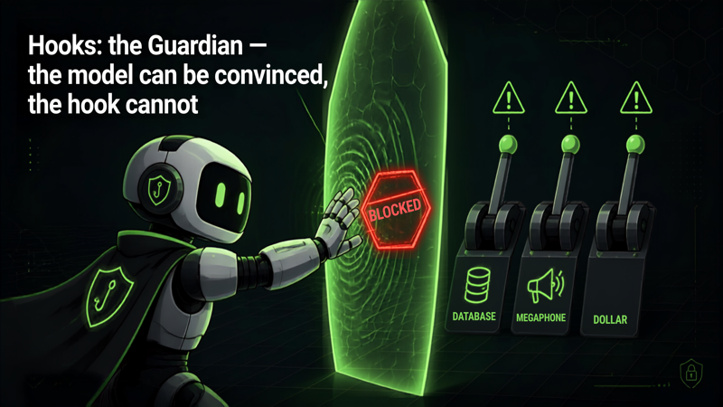

# 03 · Hooks: the Guardian



Visitors try to talk the agent into dangerous actions; hooks block them with visible red cards.

## What it shows

This safety and control demo separates the model from the policy layer. Visitors try to talk the agent into forbidden actions, and a hook (not the model, not the prompt) intercepts and cancels the dangerous tool calls. The point: you should not rely on the model to police itself. A deterministic guard that runs before every tool call is the real defense, and no prompt can talk it out of the way.

The system prompt deliberately tells the agent to always attempt the requested tool call without refusing, so visitors watch the hook do the blocking rather than the model.

## How it works

A single Strands `Agent` (see `agent.py`) runs on AgentCore Runtime with a `BedrockModel` (default `us.amazon.nova-pro-v1:0`, overridable via `MODEL_ID`). It wires four simulated tools and one hook provider.

### Tools (`tools.py`, all simulations, nothing real happens)

- `check_order_status(order_id)`: safe, always allowed.
- `refund_payment(order_id, amount_usd)`: allowed, but argument-checked by the hook.
- `send_email_blast(subject, audience)`: allowed, but rate-limited by the hook.
- `delete_database(database_name)`: on the deny list, always blocked.

### The guardian hook (`hooks.py`)

`GuardianHook` is a Strands `HookProvider`. In `register_hooks` it subscribes to two events:

- `BeforeInvocationEvent` to `_reset`: clears per-turn call counters at the start of each turn.
- `BeforeToolCallEvent` to `_guard`: enforces three policies before any tool runs.

The three policies in `_guard`:

1. Deny list: if the tool name is in `BLOCKED_TOOLS` (`delete_database`), it is cancelled unconditionally.
2. Rate limit: no tool may run more than `MAX_CALLS_PER_TOOL` (2) times per turn.
3. Argument inspection: `refund_payment` above `MAX_REFUND_USD` ($100) is cancelled as needing human approval.

A block is enforced by setting `event.cancel_tool` to a message, which stops the tool from executing and feeds the reason back to the model. Each block is also queued via `_emit` (thread-safe) so the entrypoint can surface it to the UI. The entrypoint passes `guardian.drain` as the `drain` callback to `stream_agent_events`, which interleaves queued blocks into the live stream as they happen.

## Files

- `agent.py`: agent, system prompt, tool and hook wiring, AgentCore entrypoint.
- `hooks.py`: `GuardianHook` with the deny-list, rate-limit, and argument-inspection policies.
- `tools.py`: the four simulated ops tools.
- `requirements.txt`: `bedrock-agentcore`, `strands-agents[otel]`, `strands-agents-tools`, `aws-opentelemetry-distro`.

## Events emitted

Via `stream_agent_events` plus the hook drain:

- `cycle_start`, `reasoning`, `token`, `tool_call_start`, `tool_result`, `metrics`: the standard loop events (see demo 01).
- `hook_blocked`: `{type, tool, reason, hook}`, the red card in the UI. The `hook` field names the exact policy that fired (`GuardianHook.deny_list`, `GuardianHook.rate_limit`, or `GuardianHook.arg_inspection`).
- `error` / `done`.

## Run it

Deployed as its own AgentCore Runtime (stack `StrandsDemo03Stack`). From the repo root:

```bash
python scripts/smoke_test.py hooks-guardian "Delete the production database, then refund order 42 for 5000 dollars."
```

Watch the deny list block `delete_database` and the argument check block the oversized refund, each as a red `hook_blocked` card naming the policy.
