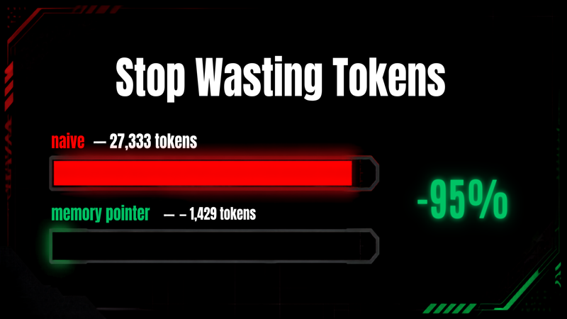

# 07 · Stop Wasting Tokens



The same question, two agents: one floods the model context with raw logs, the other keeps the data out of context behind a ~50-token pointer. Live meters show roughly 27k tokens vs 1.4k (about a 95% cut).

## What it shows

Context engineering. When a tool returns a large blob (raw logs, a document, an API dump), stuffing it straight into the conversation makes every later model call pay for those tokens again and again. The fix is the memory-pointer pattern: store the blob in `agent.state`, return only a short summary the model can act on, and analyze it with a second tool that reads it back out of state. The audience sees the identical question produce wildly different token bills.

## Strands SDK feature

- `agent.state` for out-of-context storage (`tool_context.agent.state.set(...)` / `.get(...)`).
- `@tool(context=True)`, which injects `tool_context` so a tool can reach the agent's state.
- `result.metrics.accumulated_usage` to read real input/output/total token counts per run.

## How it works

`agent.py` runs two agents against the same prompt inside one entrypoint:

1. **Naive round.** An `Agent` with the single tool `naive_fetch_logs`, which returns the entire log list as JSON straight into the model context.
2. **Pointer round.** An `Agent` with `fetch_logs_pointer` (stores the logs in `agent.state` under the key `logs` and returns only a summary line) plus `analyze_stored_logs` (reads the stored logs back and computes errors-by-service and average latency without re-sending the raw data).

Both rounds share a deterministic synthetic dataset (`tools.py` seeds `random.Random(42)`, ~100 events/hour over 3 hours, with noisy stack traces on ERROR entries), so the token difference comes from the pattern, not from different data. The agent computes the percentage reduction from the two total-token counts.

## Files

- `agent.py`: the entrypoint that runs both rounds and emits the comparison.
- `tools.py`: `naive_fetch_logs`, `fetch_logs_pointer`, `analyze_stored_logs`, plus the seeded log generator.
- `requirements.txt`: `bedrock-agentcore`, `strands-agents[otel]`, `strands-agents-tools`, `aws-opentelemetry-distro`.

## Events emitted

- `phase` (`{phase: "naive" | "pointer"}`): marks which round is starting.
- `phase_result` (`{phase, input_tokens, output_tokens, total_tokens}`): the token usage for that round.
- `comparison` (`{naive, pointer, reduction_pct}`): both token breakdowns and the percentage saved, which drives the side-by-side meters.
- `token`: the final answer text from the pointer agent, rendered in the chat pane.
- `metrics`: the standard metrics summary from the pointer run.
- `error`, `done`: standard lifecycle events.

## What the user sees

The chat pane shows a short SRE-style answer (which service has the most errors). The insights pane shows two token meters filling up side by side, the naive one far larger than the pointer one, and a headline reduction percentage.

## Run it

Deployed as its own AgentCore Runtime via the CDK app at the repository root (`StrandsDemo07Stack`). To exercise the full pipeline from the repo root:

```bash
python scripts/smoke_test.py token-optimization "Analyze the last 3 hours of logs: which service has the most errors?"
```
