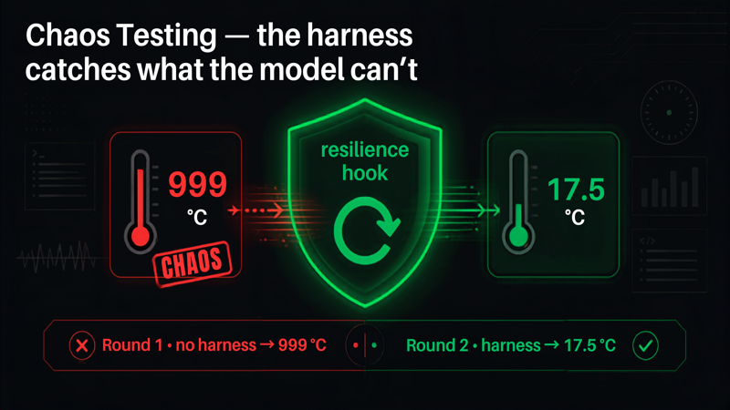

# 11 · Chaos Testing



Press play and the same question runs twice under injected chaos. Without the harness the agent reports garbage (an average temperature of 999 C); with the harness, a hook catches the impossible value and retries, so the answer is correct.

## What it shows

Resilience against corrupted tool output. The chaos is injected deterministically by a hook, not by a real API failure, so the before/after contrast is reproducible at a booth. Round one runs with chaos only and the model faithfully reports the nonsense, because to the model 999 C is just another number. Round two runs the same chaos plus a verification harness that checks the value against physical bounds and asks Strands to re-run the tool, recovering the real data. The takeaway: the harness catches what the model cannot.

## Strands SDK feature

- `AfterToolCallEvent`: hooks that run after a tool call, able to write `result` and `retry`.
- `event.retry = True`: Strands' native tool retry, which re-runs the tool.
- `HookProvider` / `HookRegistry` (`register_hooks`, `add_callback`) and `BeforeInvocationEvent` to reset per-run state.
- Hook ordering matters: `AfterToolCallEvent` runs callbacks in reverse registration order, so the resilience hook is registered first and the chaos hook second, which means on After events chaos runs first (corrupts) and resilience runs after (sees the corruption).

## How it works

`agent.py` runs the same prompt in two rounds against a travel agent backed by real keyless APIs (`tools.py`: `geocode_place` and `climate_summary` via Open-Meteo, `wikipedia_summary` via Wikipedia, each with an in-process cache and a small offline fallback for a few well-known cities).

- **Round 1 (`chaos_naive`)**: `hooks=[chaos]`. `ChaosHook` rewrites the first `climate_summary` result's `avg_temp_c` to `999.0` (marking the source `CHAOS-corrupted`) exactly once per run. No harness, so the agent reports the garbage.
- **Round 2 (`chaos_resilient`)**: `hooks=[resilience, chaos]`. `ResilienceHook` inspects the `climate_summary` result on `AfterToolCallEvent`; if the tool errored, or if `avg_temp_c` is outside the sane range (`-40 C` to `45 C`), it sets `event.retry = True`. On the retry, `ChaosHook`'s one-shot guard has already fired, so the tool returns the real value and the harness lets it through.

Each hook exposes a `drain()` method that returns queued insight events; the entrypoint interleaves those into the stream so the UI shows the chaos and the recovery as they happen.

## Files

- `agent.py`: runs the two rounds and wires the hooks in the right order.
- `hooks.py`: `ChaosHook` (corrupts) and `ResilienceHook` (verifies and retries), plus the bounds constants (`SANE_TEMP_MIN_C`, `SANE_TEMP_MAX_C`, `CORRUPT_TEMP_C`).
- `tools.py`: `geocode_place`, `climate_summary`, `wikipedia_summary` over real public APIs with caching and fallbacks.
- `test_hooks.py`: pure-logic tests (no model, no AWS) that simulate the `AfterToolCallEvent` and assert that chaos corrupts the first climate result exactly once, ignores other tools, resilience retries on the impossible value and on an error status, passes a sane value untouched, and that the two-round end-to-end flow recovers. Run: `python test_hooks.py` or `pytest test_hooks.py`.
- `requirements.txt`: `bedrock-agentcore`, `strands-agents[otel]`, `strands-agents-tools`, `aws-opentelemetry-distro`.

## Events emitted

Both rounds stream through the shared `stream_agent_events` helper (so `cycle_start`, `tool_call_start`, `tool_result`, `reasoning`, `token`, `metrics`), plus:

- `phase` (`{phase: "chaos_naive" | "chaos_resilient"}`): marks which round is starting.
- `chaos_injected` (`{tool, effect, detail}`): emitted by `ChaosHook` when it overwrites the result.
- `recovered` (`{tool, action, detail}`): emitted by `ResilienceHook` when it verifies and requests a retry (`action` is `verify_retry` for the impossible value or `retry` for an errored tool).
- `error`, `done`: standard lifecycle events.

## What the user sees

The chat pane shows two answers to the same question: the first quoting the absurd 999 C, the second quoting the real climate figure. The insights pane shows a red chaos-injected card in both rounds and, in the second round, a recovery card followed by the corrected result.

## Run it

Deployed as its own AgentCore Runtime via the CDK app at the repository root (`StrandsDemo11Stack`). To exercise the full pipeline from the repo root:

```bash
python scripts/smoke_test.py chaos-resilience "What is the historical climate like in Lisbon?"
```
